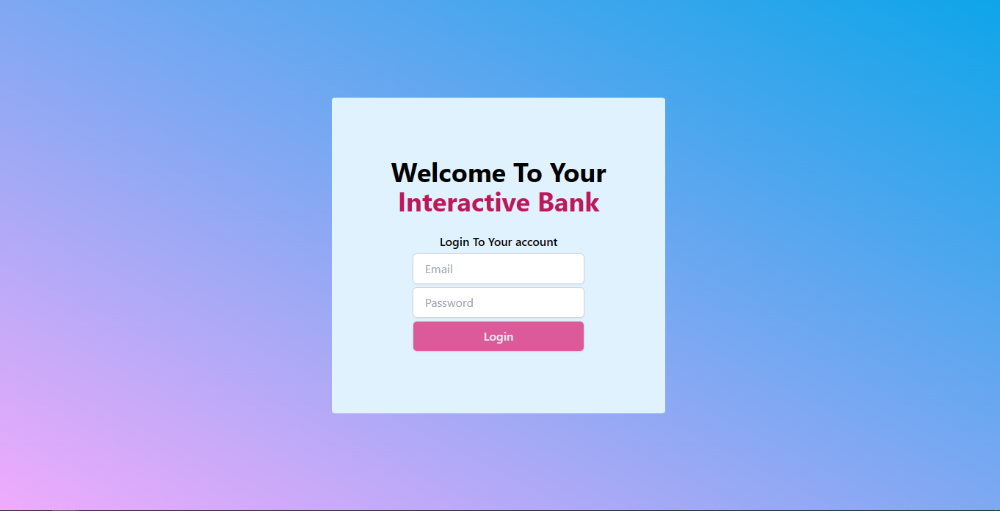
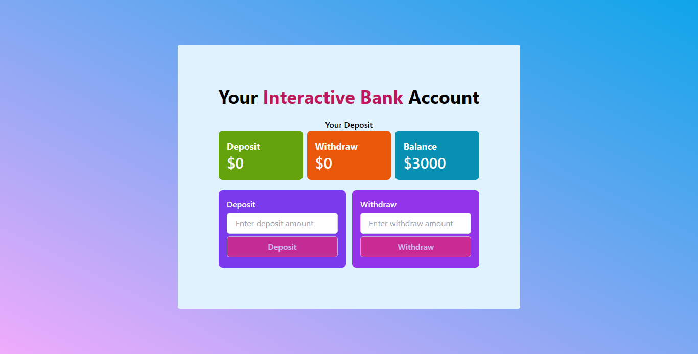

# interactive-bank-with-plain-js
### It is a very simple interactive bank
### It has some simple feature. They are the followings:
1. Simple login feature. The `Login` button is disable until a valid email and password is provided. The email has to have `@` symble. And the password has to be at least 8 character.
2. Simple deposit form. It tracks how much has been deposited and added to the main balance.
3. Simple withdraw form with error message if user tries to withdraw more than the balance. It also tracks how much has been withdrawn and subtracted from the main balance.

### Here is some screenshot

